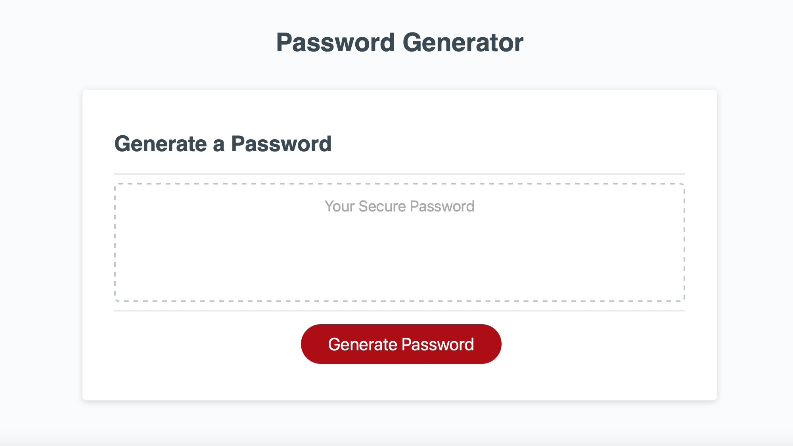

# 03 JavaScript: Password Generator

## Your Task

In this weeks homework we had to modify existing starter code to create a password generator that enables employees to generate passwords based off the criteria they choose. 

The password can contain:

    -special characters
    -upper case
    -lower case
    and/or
    -numbers

Password must be at least 8 characters, and less than 128 characters

After all prompts are answered password is then generated. 

Link to Deployed Application:
 https://randyfasion.github.io/PasswordGenerator/

Link to GitHub Repository:
https://github.com/randyfasion/PasswordGenerator